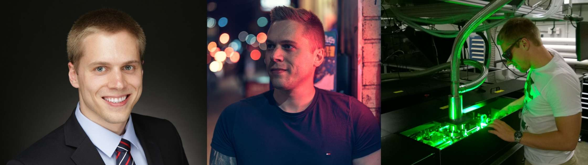

<!-- Profile Banner -->

  

<h1 align="center">I'm Florian Wilhelm</h1>

Senior Software Developer combining physics, automation, and full-stack development.

  
  
  
  
  

---

### About Me
I’m a **Senior Software Developer at USNR** in British Columbia, Canada, building real-time optimization systems for sawmills and industrial automation.  
With a background in **computational physics, economics, and software engineering**, I love solving hard technical problems that connect the digital world with real machines.

Outside of work, I run **Flognity Media & Software Solutions**, where I develop tools, apps, and designs that celebrate Canada and empower sustainable technology.

---

### Highlights
- 10+ years of software development experience (enterprise & industrial automation)
- Expert in C, C++, SQL, and real-time optimization
- Bilingual (English/German) with international project leadership
- Founder of [Maple & Sombrero](https://mapleandsombrero.ca/) and [Flognity Media & Software Solutions](https://flognitymedia.com/)

---

### Tech Stack

    
    
    
    
    
    
    
    
    
    
    

#### Frameworks & Package Managers

    
    
    
    
    
    
    
    
    
    
    

#### Databases

    
    
    

#### CI/CD, Version Control & Testing

    
    
    
    
    
    

#### Collaboration & Documentation

    
    
    
    
    
    

#### Cloud & Hosting

    
    
    

---

### Experience
#### 🏭 USNR – Industrial Optimization Software  
**Senior Software Developer** • Salmon Arm, British Columbia, Canada  
Building next-generation optimization and control systems for sawmills used across North America and Europe.  
- Designed and implemented algorithms for lumber scanning and defect detection in **C++**.  
- Maintained and improved the **MillGenius**, **Sawmill Suite** and **MillExpert** software used in real-time production environments.  
- Acted as the **German-speaking technical lead**, helping secure new international contracts.  
- Delivered on-site installations and system tuning in Canada, the U.S., and Germany.

#### 🏦 Helaba – Landesbank Hessen-Thüringen  
**Application Developer (Front Office IT)** • Frankfurt, Germany  
Developed and modernized financial systems to support regulatory compliance, trading operations, and IT workflows.  

**Key Achievements**
1. **Developed full-stack internal web applications with C#, .NET, and SQL Server to support front-office operations**

    
    
    
    
    
    
    
    

   - Created a secure intranet web tool to track IT access requests, approvals, and automated provisioning for critical systems.
   - Rebuilt and extended the bank’s IT-software-request platform to streamline approval, testing, and deployment workflows.
   - Ensured compliance with new regulatory tracking requirements across multiple departments.  

2. **Automated pre-trade and post-trade transparency reporting workflows (Perl, Python, SQL, IBM Integration Bus)**

    
    
    

   - Implemented fully automated reporting interfaces that generated and transmitted regulatory data “as soon as technically possible,” replacing manual submissions.  
   - Integrated trading platforms with Approved Publication Arrangements (APA) to ensure compliance with MiFID II transparency rules.
   - Achieved significant efficiency gains: saved **1–2 hours per trader per day** across **150+ users**, freeing up hundreds of trading hours daily. 

3. **Built and maintained cross-platform trading desk interfaces (Bloomberg, Murex, MarkitWire)**

    
    
    
    
    

   - Integrated trading, settlement, and accounting systems to eliminate redundant manual trade entries and ensure data consistency.
   - Quickly learned and applied **proprietary programming languages** used by vendor platforms to achieve deep system integration.
   - Developed synchronization workflows using **IBM Integration Bus, Perl, C#, and SQL stored procedures**, automating trade data exchange between Bloomberg, Murex, and MarkitWire. 

4. **Coordinated modernization of legacy trading systems with 10+ freelancers and 50+ consultants**

    
    
    
    
    

   - Oversaw interface redevelopment during a major front-office software upgrade, ensuring compatibility with modern APIs and regulatory standards.  
   - Conducted code reviews, enforced coding and testing standards, and supported Docker-based test environment setup. 
   - Implemented CI/CD workflows with **Jira, Jenkins, and SonarQube** to guarantee continuous integration and 100% test coverage.

---

### Featured Projects

#### ⚡ [Carbon Aware Scheduler](https://github.com/flognity/carbon-aware-scheduler-lab)
An open-source framework that schedules compute tasks during low-carbon energy windows.  
Built in **Python + C++ (pybind11)** with real-time data from **ElectricityMap** and **WattTime** APIs.  
Includes a command-line interface, visualization dashboard, and modular provider system.

#### 🍁 [Maple & Sombrero](https://mapleandsombrero.ca)
A proudly Canadian apparel brand celebrating regional pride and ethical production.  
Built with **Shopify**, **HTML/CSS**, and **custom SEO-optimized product pages** in English and Quebec French.  
All designs are printed in Ontario and reflect Canadian craftsmanship and values.

#### 🏭 [USNR – Industrial Optimization Software](https://usnr.com)
Contributing to **sawmill automation** software used across North America and Europe.  
Focus areas: optimization algorithms, multi-threaded C++ systems, and multilingual client support.  
Helped secure new international contracts by serving as the German-speaking technical lead.

---

### Get in Touch

  <a href="https://flognity.com" target="_blank"><b>🌐 Visit my website:</b> flognity.com</a> 
  <a href="https://mapleandsombrero.ca/" target="_blank"><b>🛍️ Visit my Store:</b> mapleandsombrero.ca/</a> 
  <a href="https://flognitymedia.com/" target="_blank"><b>🏢 Visit Business Website:</b> flognitymedia.com</a> 
  <a href="mailto:flognity@gmail.com"><b>✉️ Email:</b> flognity@gmail.com</a> 
  <a href="https://www.linkedin.com/in/florian-wilhelm/" target="_blank"><b>💼 LinkedIn:</b> linkedin.com/in/florian-wilhelm</a>

 ---

  Made by Florian Wilhelm in Salmon Arm, BC, Canada 🍁

